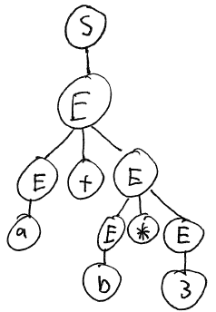
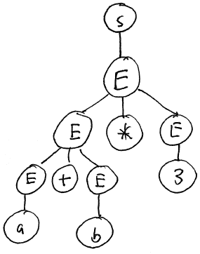

Context-Free Languages
======================

Recall that the syntactic structure of a programming language's syntax is typically a *context-free language*. Context-free languages are more powerful than regular languages because they can describe nested constructs such as parentheses.

Context-free languages may be specified using a context-free grammar (CFG).

A CFG consists of *terminals*, *nonterminals*, and *productions*:

Terminals are symbols in the language's alphabet. By convention, we write them as lower-case letters.

Nonterminals are placeholders in productions. By convention, we write them as upper-case letters.

A production specifies a grammar rule. It has a single nonterminal on the left hand side and a sequence of terminals and nonterminals on the right side. The right-hand side may be the empty string (represented as &epsilon;), in which case we say that the production is an epsilon-production. The idea behind a production is that any occurrence of the nonterminal on the left hand side of the production can be replaced by the string of symbols on the right hand side.

Conceptually, a CFG generates all possible strings in a context-free language. Starting from a string consisting of a single nonterminal, the start symbol, the CFG is used to rewrite the string until it contains nothing but terminal symbols. The resulting string of terminal symbols is a string in the language the CFG specifies.

Example: a CFG for the language of all palindromes using letters a and b

> S → P
>
> P → &epsilon;
>
> P → a
>
> P → b
>
> P → aPa
>
> P → bPb

The nonterminal S is the start symbol. It is involved in one production: it may be replaced by the nonterminal P.

The nonterminal P is a palindrome. There are five productions involving P. They may be used to generate new (possibly larger) palindromes.

The sequence of productions used to generate a string is known as the string's derivation.

E.g.: the derivation for the string abbabba

> String | Production to apply
> ------ | -------------------
> S | S → P
> P | P → aPa
> aPa | P → bPb
> abPba | P → bPb
> abbPbba | P → a
> abbabba |

CFGs and Programming Languages
------------------------------

An important application of context-free grammars is to specify the syntax of a programming language. Programming languages often used balanced constructs (parentheses, brackets, etc.) in their syntax. CFGs (and context-free languages) provide the expressive power needed to define the syntax of such languages.

As an example, consider a simple expression grammar to define mathematical expressions. We will use the following set of terminal symbols:

> a,b,0,1,2,3,4,5,6,7,8,9,+,-,\*,/

"a" and "b" could be variables. The digits 0-9 are literal numbers. +, -, \*, and / are addition, subtraction, multiplication, and division.

> S → E
>
> E → E + E | E - E | E \* E | E / E
>
> E → a | b | 0 | 1 | 2 | 3 | 4 | 5 | 6 | 7 | 8 | 9

This grammar can produce any expression involving variables a and b, single-digit numbers, and +,-,\*,/ operators. Note that we have adopted the convention of using the "|" character to express a set of alternative productions. Really, these are separate productions sharing the same nonterminal symbol on the left-hand side. So, when we say

> E → a | b | 0 | 1 | ... | 9

it is really a shorthand for 12 different productions:

> E → a
>
> E → b
>
> E → 0
>
> E → 1
>
> ...
>
> E → 9

Parsing and ambiguity
---------------------

Parsing is the following problem: given a grammar and a string of terminal symbols, find a series of productions that derive the string of nonterminals from the start symbol.

E.g., given the expression

> a + b \* 3

How can we parse this string? Here is one way:

> String | Production to apply
> ------ | -------------------
> S | S → E
> E | E → E + E
> E + E | E → a
> a + E | E → E * E
> a + E * E | E → b
> a + b * E | E → 3
> a + b * 3 |

This is a leftmost derivation because at each step we apply a production to expand the leftmost nonterminal symbol.

The parsing of an input string can be used to build a data structure called a syntax tree. The interior nodes of the tree are nonterminals, and the leaves are terminals. Each time a production is applied, child nodes are added to represent the symbols produced by the production. Here is the syntax tree for the derivation above:

> 

The syntax tree is like a syntax diagram showing the underlying structure of the string of symbols. In this case, the s tree suggests that the multiplication should be done before the addition. This agrees with the conventions of arithmetic, where multiplication and division take precedence over addition and subtraction.

Unfortunately, this is not the only possible syntax tree for the input string "a + b \* 3". Here is another derivation of the string that produces a different syntax tree:

> String | Production to apply
> ------ | -------------------
> S | S → E
> E | E → E * E
> E * E | E → E + E
> E + E * E | E → a
> a + E * E | E → b
> a + b * E | E → 3
> a + b * 3 | 

This derivation is also a leftmost derivation. However, it produces a different syntax tree:

> 

This syntax tree does not match the conventions of arithmetic because it suggests that the addition should be done before the multiplication.

A grammar that can produce more than one syntax tree from an input string is said to be ambiguous. Because a syntax tree represents semantic information---information about the meaning of an input string---ambiguity is an undesirable property. An ambiguous grammar assigns multiple meanings to a single string of symbols.
